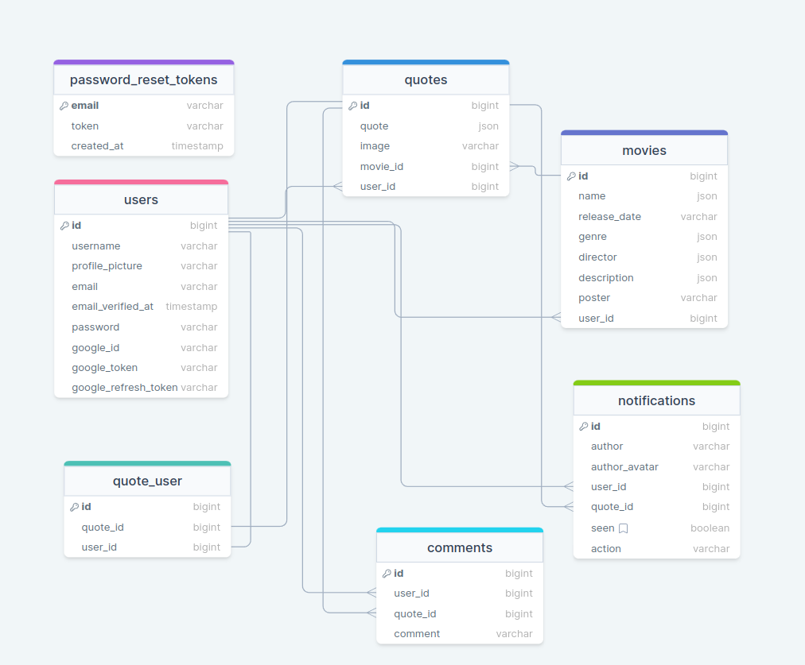

# Cite it

The project is about quotes from different movies. Users can see posts on a news feed page. Each post contains information about the post author, the quote itself, and the movie from which the quote is taken. Authorized users are able to like a post and leave a comment. Authors get notifications if anyone interacts with any of their posts. Likes, Comments, and notifications are updated in real time. Users can authenticate with a Google account, as well as a password and email. They also can update their profile.

### Table of Contents

-   [Prerequisites](#prerequisites)
-   [Tech Stack](#tech-stack)
-   [Getting Started](#getting-started)
-   [Migrations](#migration)
-   [Development](#development)
-   [Project Structure](#project-structure)

### Prerequisites

-    *PHP@8.2 and up*
-    _MYSQL@8 and up_
-    _composer@2.5 and up\_

### Tech Stack

-    [Laravel@10.5](https://laravel.com/docs/6.x) - back-end framework
-    [Pusher](https://tailwindcss.com/) - works as a real-time communication layer between the server and the client.
-    [Tailwind](https://pusher.com/) - utility-first css framework

### Getting Started

1\. First of all you need to clone Epic Movie Quotes repository from github:

```sh
git clone https://github.com/RedberryInternship/giorgi-kvrivishvili-cite-it-back
```

2\. Next step requires you to run _composer install_ in order to install all the dependencies.

```sh
composer install
```

3\. Now we need to set our env file. Go to the root of your project and execute this command.

```sh
cp .env.example .env
```

And now you should provide **.env** file all the necessary environment variables:

**MYSQL:**

> DB_CONNECTION=mysql

> DB_HOST=127.0.0.1

> DB_PORT=3306

> DB_DATABASE=**\***

> DB_USERNAME=**\***

> DB_PASSWORD=**\***

###

**MAIL:**

> MAIL_DRIVER=**\***

> MAIL_HOST=**\***

> MAIL_PORT=**\***

> MAIL_USERNAME=**\***

> MAIL_PASSWORD=**\***

> MAIL_ENCRYPTION=**\***

> MAIL_FROM_NAME=**\***

###

**Pusher:**

> PUSHER_APP_ID=**\***

> PUSHER_APP_KEY=**\***

> PUSHER_APP_SECRET=**\***

> PUSHER_HOST=**\***

> PUSHER_PORT=**\***

> PUSHER_SCHEME=**\***

> PUSHER_APP_CLUSTER=**\***

###

**Google Client:**

> GOOGLE_CLIENT_ID=**\***

> GOOGLE_CLIENT_SECRET=**\***

###

If you have a separate client app:

###

> CLIENT_APP_URL=**\***

after setting up **.env** file, execute:

```sh
php artisan config:cache
```

in order to cache environment variables.

4\. Now execute in the root of you project following:

```sh
  php artisan key:generate
```

Which generates auth key.

##### Now, you should be good to go!

### Migration

if you've completed getting started section, then migrating database if fairly simple process, just execute:

```sh
php artisan migrate
```

### Development

You can run Laravel's built-in development server by executing:

```sh
  php artisan serve
```

when working on JS you may run:

```sh
  npm run dev
```

it builds your js files into executable scripts.
If you want to watch files during development, execute instead:

```sh
  npm run watch
```

it will watch JS files and on change it'll rebuild them, so you don't have to manually build them.

### Project Structure

```bash
├─── app
│   ├─── Actions
│   ├─── Broadcasting
│   ├─── Console
│   ├─── Events
│   ├─── Exceptions
│   ├─── Helpers
│   ├─── Http
│   ├─── Models
│   ├─── Notifications
│   ├─── Policies
│   ├─── Providers
│   │... Rules
├─── bootstrap
├─── config
├─── database
├─── lang
├─── public
├─── readme
├─── resources
├─── routes
├─── storage
├─── tests
- .env
- artisan
- composer.json
- package.json
- phpunit.xml
- postcss.config.js
- README.md
- tailwind.config.js
- vite.config.js

```

[Database Design Diagram](https://drawsql.app/teams/georges-team-6/diagrams/movie-quotes-epic)


